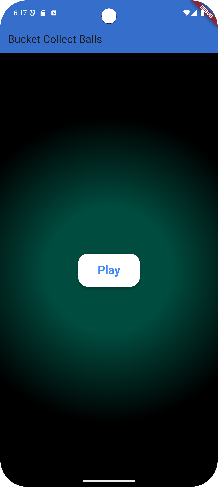
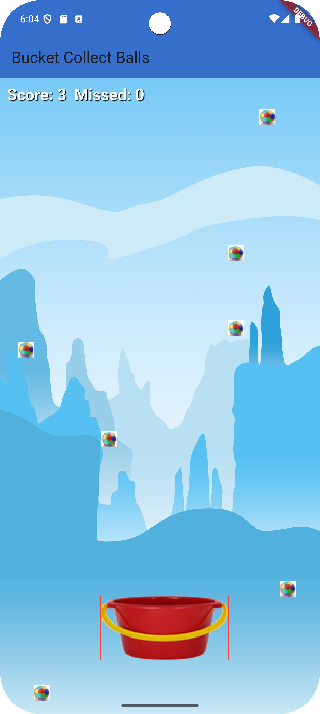
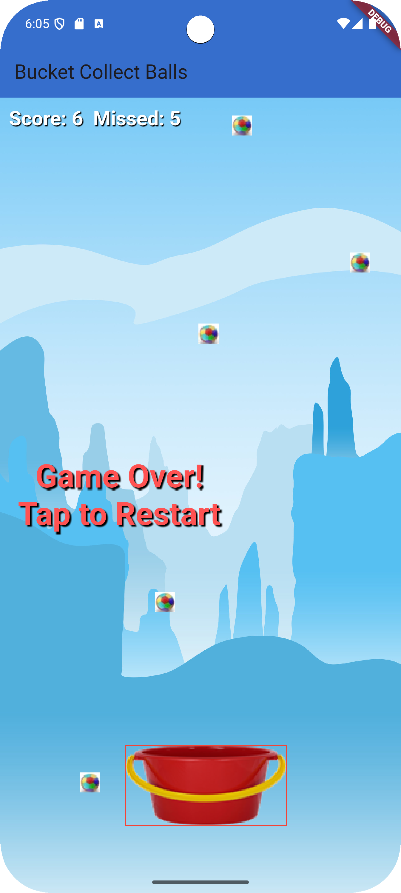

# gameapp

# Bucket Collect Balls

**Bucket Collect Balls** is a Flutter-based mobile game developed as a project for the Spring 2025 Mobile Programming course. Players control a bucket to catch falling balls, earning points for each catch while avoiding misses. The game features a responsive mobile interface, sound effects, and a visually appealing start screen, optimized for Android devices.

## Project Overview

The game challenges players to move a bucket horizontally across the screen to catch randomly spawned balls. The game ends after five missed balls, with a tap-to-restart option. Key features include a scalable bucket, dynamic ball spawning, score tracking, and audio feedback for catches and misses. The start screen features a teal radial gradient background, enhancing the user experience.

## Features

- **Gameplay**:
    - Control a bucket (~164x82 dp) using drag gestures to catch falling balls (~10 dp radius).
    - Score increases with each catch; game ends after 5 misses.
    - Tap to restart after game-over.
- **Visuals**:
    - Start screen with a teal-to-black radial gradient background.
    - In-game background: Custom image (`background.jpg`) or blue-to-purple gradient.
    - Bucket: Custom image (`bucket.png`) or cyan rectangle with black border and red debug outline.
    - Balls: Custom image (`ball.png`) or red circles.
- **Audio**:
    - Sound effects for catching (`catch.mp3`) and missing (`miss.mp3`) balls using `audioplayers`.
- **Mobile Optimization**:
    - Responsive layout for ~411x914 dp screens (e.g., Pixel 6 emulator).
    - Safe area handling for navigation bars (~48 dp).
    - Smooth drag controls with 1.5x sensitivity.

## Technologies

- **Flutter**: Framework for cross-platform mobile development (Dart).
- **Audioplayers**: Package for playing sound effects.
- **Android Studio**: IDE for development and emulation.
- **Git/GitHub**: Version control and hosting.
- **NDK**: Version 27.0.12077973 for Android compatibility.

## File Structure


BucketCollectBalls/
├── android/
│   └── app/
│       └── build.gradle.kts  # Android build configuration
├── assets/
│   ├── images/
│   │   ├── bucket.png        # Bucket image (160x80 px)
│   │   ├── ball.png          # Ball image (20x20 px)
│   │   └── background.jpg    # Background image (1080x1920 px)
│   └── sounds/
│       ├── catch.mp3         # Catch sound effect
│       └── miss.mp3          # Miss sound effect
├── lib/
│   ├── game/
│   │   ├── bucket.dart       # Bucket class
│   │   ├── ball.dart         # Ball class
│   │   ├── game_controller.dart  # Game logic
│   │   └── game_widget.dart  # Game rendering
│   ├── screens/
│   │   └── game_screen.dart  # Main game screen
│   └── main.dart             # App entry point
├── pubspec.yaml              # Dependencies and assets
├── .gitignore                # Ignored files (e.g., build/, .dart_tool/)
└── README.md                 # Project documentation






## Setup Instructions

### Prerequisites
- **Flutter SDK**: Version 3.x or later ([install guide](https://flutter.dev/docs/get-started/install)).
- **Android Studio**: For emulator and NDK (27.0.12077973).
- **Git**: For cloning the repository.
- **GitHub Account**: To access the repository.

### Steps
1. **Clone the Repository**:
   ```bash
   git clone https://github.com/your-username/BucketCollectBalls.git
   cd BucketCollectBalls


## Setup Instructions

### Prerequisites
- **Flutter SDK**: Version 3.x or later ([install guide](https://flutter.dev/docs/get-started/install)).
- **Android Studio**: For emulator and NDK (27.0.12077973).
- **Git**: For cloning the repository.
- **GitHub Account**: To access the repository.

### Steps
1. **Clone the Repository**:
   ```bash
   git clone https://github.com/dkarmoh/BucketCollectBalls.git
   cd BucketCollectBalls


## Setup Instructions

### Prerequisites
- **Flutter SDK**: Version 3.x or later ([install guide](https://flutter.dev/docs/get-started/install)).
- **Android Studio**: For emulator and NDK (27.0.12077973).
- **Git**: For cloning the repository.
- **GitHub Account**: To access the repository.

### Steps
1. **Clone the Repository**:
   ```bash
   git clone https://github.com/dkarmoh/BucketCollectBalls.git
   cd BucketCollectBalls
- [Lab: Write your first Flutter app](https://docs.flutter.dev/get-started/codelab)
- [Cookbook: Useful Flutter samples](https://docs.flutter.dev/cookbook)

For help getting started with Flutter development, view the
[online documentation](https://docs.flutter.dev/), which offers tutorials,
samples, guidance on mobile development, and a full API reference.
